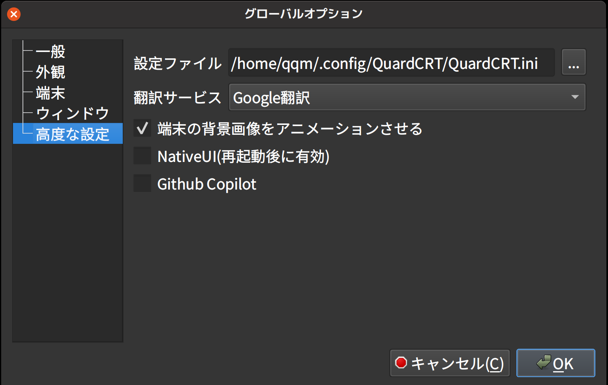

<a href="../../en/latest/configuration.html">🇺🇸 English</a> | <a href="../../zh-cn/latest/configuration.html">🇨🇳 简体中文</a> | <a href="../../zh-tw/latest/configuration.html">🇭🇰 繁體中文</a> | <a href="../../ja/latest/configuration.html">🇯🇵 日本語</a>

# 設定

QuardCRT には、グローバルオプションとセッションオプションが含まれています。グローバルオプションは QuardCRT のグローバル設定であり、ユーザーの個人的な使用を便利にするために設定ファイルに永続的に保存されます。セッションオプションは、現在の特定のセッションの設定を一時的に調整するために使用されます。

## グローバルオプション

まず、QuardCRT のグローバル設定ファイルは `<user directory>/.config/QuardCRT/QuardCRT.ini` にあります。また、QuardCRT のメインインターフェイスを開き、オプション --> グローバルオプション --> 詳細を選択して、現在の設定ファイルパスを表示することもできます。

以下では、分類されたグローバル設定の各部分について説明します。

### 一般

一般的な設定には、QuardCRT のいくつかの基本的な設定が含まれています。

- 新しいタブモード

    新しいタブモードは、ユーザーがタブ ➕ ボタンまたはショートカットキーを使用して新しいタブを作成するときに新しいタブが開かれる方法を表します。選択できるモードは 3 つあります。

    - 新しいセッション: クイック接続ダイアログがポップアップし、ユーザーは新しいタブの接続情報を構成し、新しいセッションを生成します。
    - クローンセッション: 現在のタブのセッション情報をコピーし、新しいセッションを生成します (現在のタブのハードウェアリソースが単一のデバイスである場合、クイック接続ダイアログがポップアップし、コピーできないハードウェアリソース情報をユーザーが構成します)。
    - ローカルシェル: 新しいローカルターミナルセッションを生成します。

- 新しいタブの作業ディレクトリ

    ユーザーが新しいローカルターミナルセッションを作成するときの新しいセッションの作業ディレクトリ。デフォルトでは、このオプションには `ユーザーのホームディレクトリ` のみが含まれています。他のオプションを追加する必要がある場合は、ディレクトリブックマークに追加する必要があります。

- タブタイトルモード

    タブタイトルモードは、タブタイトルの表示モードを表します。選択できるモードは 3 つあります。

    - 簡潔: 固定幅表示で、完全なセッションタイトルは表示されません。
    - フル: 完全なセッションタイトルを表示します。
    - スクロール: 完全なセッションタイトルを表示し、タイトルが長すぎる場合は自動的にスクロールして表示します。

- タブタイトル幅

    タブタイトルモードが簡潔/スクロールの場合、タブタイトルの固定幅。単位: px。

- タブプレビュー

    ユーザーがタブにマウスを重ねると、タブのプレビュー情報が表示されます。

- プレビューウィンドウ幅

    タブプレビューウィンドウの幅。単位: px。

### 外観

外観設定には、ターミナルの外観設定が含まれています。

- カラースキーム

    QuardCRT は、ユーザーが選択できるカラースキームを数十種類提供しており、ユーザーは好みに応じて適切なカラースキームを選択できます。

- フォント
    
    ターミナルのフォント設定には、フォント名とフォントサイズが含まれます。Built-in は QuardCRT の組み込みフォントを表し、ユーザーはシステムにすでにインストールされているフォントも選択できます。Built-in フォントは、プログラミングに適した等幅フォントを選択します。ユーザーが選択したフォントを Built-in フォントに変更する必要がある場合は、フォントを選択するときにキャンセルボタンをクリックして Built-in フォントに戻すことができます。

- 背景画像

    ターミナルの背景画像設定では、ユーザーは好きな背景画像をターミナルの背景として選択できます。サポートされる画像形式には、bmp、jpg、jpeg、png、gif が含まれます。gif 形式の画像はアニメーション形式でターミナルの背景に表示されます。高度なオプションで `ターミナル背景がアニメーションをサポート` がチェックされている場合、mp4、avi、mov、wkv などのビデオ形式もターミナルの背景として選択できますが、これには多くのシステムリソースが必要です。現在の背景画像選択をクリアするには、クリアボタンをクリックします。

- 背景モード

    ターミナルの背景モードには、6 つのモードがあります。

    - なし: 背景画像のサイズを調整しません。
    - ストレッチ: 背景画像をターミナルのサイズに合わせてストレッチします。
    - ズーム: 背景画像をターミナルのサイズに合わせて拡大縮小します。
    - フィット: 背景画像のアスペクト比を保持して、背景画像をターミナルで完全に表示します。
    - センター: 背景画像をターミナルの中央に表示します。
    - タイル: 背景画像をターミナル全体に敷き詰めます。

- 背景画像の不透明度

    端末の背景の透明度。値の範囲は 0 ～ 100 で、0 は完全に透明、100 は完全に不透明を意味します。

### ターミナル

ターミナル設定には、ターミナルのいくつかの基本的な設定が含まれています。

- スクロールバックライン

    端末のスクロールバックラインは、端末にキャッシュされる最大行数を表します。大きな値はより多くのメモリを消費します。

- カーソルスタイル

    端末のカーソルスタイルには、3 つのスタイルがあります。

    - ブロック: 実線の長方形ブロックとして表示します。
    - 下線: 下線として表示します。
    - I-ビーム: 垂直線として表示します。

- カーソル点滅

    端末のカーソル点滅。チェックを入れると、カーソルが点滅します。

- 単語文字

    ダブルクリック選択の一部として考えられる特殊文字を示します。デフォルトでは: `@-./_~`。

### ウィンドウ

ウィンドウ設定には、QuardCRT のウィンドウ設定が含まれています。

- ウィンドウの不透明度

    アプリケーションウィンドウ全体の透明度。値の範囲は 0 ～ 100 で、0 は完全に透明、100 は完全に不透明を意味します。

### 高度

高度な設定には、QuardCRT のいくつかの高度な設定が含まれています。

- 設定ファイルパス

    QuardCRT の設定ファイルパス。ユーザーはここで現在の設定ファイルパスを表示できます。

- 翻訳サービス
    
    QuardCRT の翻訳サービス。ユーザーは Google 翻訳\Baidu 翻訳\Bing 翻訳を選択できます。

- ターミナル背景がアニメーションをサポート

    ターミナルの背景がアニメーションをサポートすることを示すためにチェックします。ユーザーは mp4、avi、mov、wkv などのビデオ形式をターミナルの背景として選択できますが、これには多くのシステムリソースが必要です。

- ネイティブ UI

    主に MacOS ユーザー向けに、ネイティブ UI の使用を示すためにチェックします。チェックすると、QuardCRT の UI は MacOS のスタイルにより一致します。ただし、マルチプラットフォームのユーザーが統一されたスタイルと使用習慣を維持するためにチェックすることはお勧めしません。(このオプションは QuardCRT を再起動して有効にする必要があります)

- Github Copilot

    This feature is not yet available, please look forward to it.
